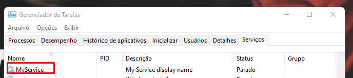

# pythonService
<h2 align=center> 📑 Introduction </h2>
Unable to schedule a python service with task scheduler in a client server, Windows Serive is an alternative way to run a python service in background.
<p>This is a example service that send an e-mail each hour. </p>
<h2 align=center> 📑 Windows Service </h2>
"Microsoft Windows services, formerly known as NT services, enable you to create long-running executable applications that run in their own Windows sessions. These services can be automatically started when the computer boots, can be paused and restarted, and do not show any user interface. These features make services ideal for use on a server or whenever you need long-running functionality that does not interfere with other users who are working on the same computer." <a href="https://learn.microsoft.com/en-us/dotnet/framework/windows-services/introduction-to-windows-service-applications">Windows Serice</a>
<h2 align=center> 👨🏻‍💻 How to get started? </h2> 

### Prerequisites:
```
pip3 install pywin32 pyinstaller
```
### Build
```
pyinstaller.exe --onefile --runtime-tmpdir=. --hidden-import win32timezone main.py
```

### With Administrator privilges
### Install
```
dist\main.exe install
```

### Start
```
dist\main.exe start
```

### Install with autostart
```
dist\main.exe --startup delayed install
```

### Debug
```
dist\main.exe debug
```

### Stop
```
dist\main.exe stop
```

### Uninstall
```
dist\main.exe remove
```

<h2 align=center> 👨🏻‍💻 Installation Example </h2> 

**After the build is completed**

### Install


### Start


### Service Running



<h2 align=center> 📑 References </h2>

- [Windows Serice](https://learn.microsoft.com/en-us/dotnet/framework/windows-services/introduction-to-windows-service-applications)
- [Creating Windows service in Python](https://metallapan.se/post/windows-service-pywin32-pyinstaller/)
